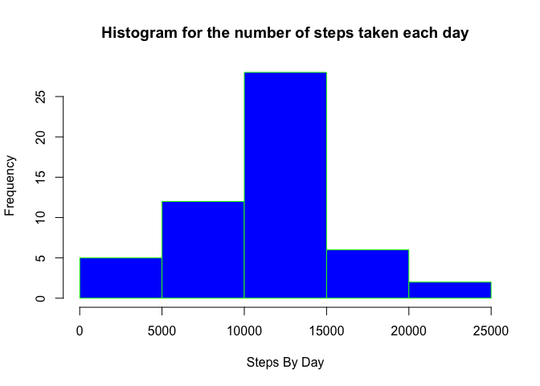
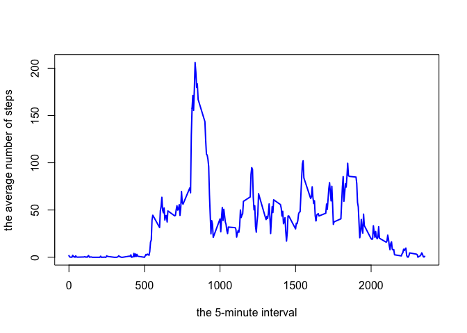
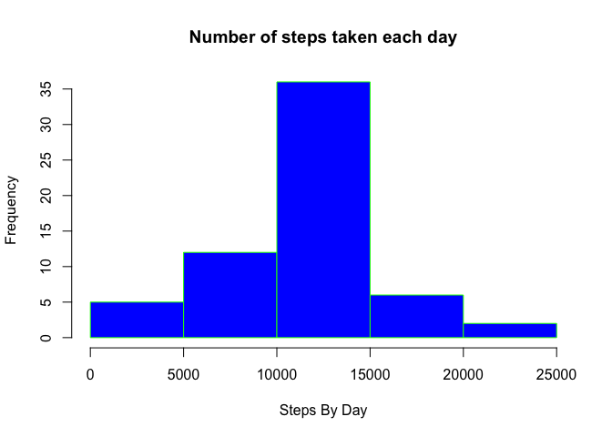

# Reproducible Research: Peer Assessment 1


## Loading and preprocessing the data


1- load the data from the csv file

```r
activity_monitoring <- read.csv("activity.csv")
```

2-Prcess the data by calculating the total number of steps taken each day


```r
step_by_day <- aggregate(steps ~ date, activity_monitoring, sum, na.rm =TRUE)
```

3- Aanalyse the data


```r
summary(activity_monitoring)
```

```
##      steps                date          interval     
##  Min.   :  0.00   2012-10-01:  288   Min.   :   0.0  
##  1st Qu.:  0.00   2012-10-02:  288   1st Qu.: 588.8  
##  Median :  0.00   2012-10-03:  288   Median :1177.5  
##  Mean   : 37.38   2012-10-04:  288   Mean   :1177.5  
##  3rd Qu.: 12.00   2012-10-05:  288   3rd Qu.:1766.2  
##  Max.   :806.00   2012-10-06:  288   Max.   :2355.0  
##  NA's   :2304     (Other)   :15840
```

## What is mean total number of steps taken per day?

1- Make a histogram of the total number of steps taken each day


```r
hist(step_by_day$steps, main="Histogram for the number of steps taken each day", 
     xlab="Steps By Day", 
     border="green", 
     col="blue")
```

<!-- -->

2- Calculate the *mean* and the *median* total number of steps taken per day

- The mean


```r
mean(step_by_day$steps)
```

```
## [1] 10766.19
```
- The Median


```r
median(step_by_day$steps)
```

```
## [1] 10765
```

## What is the average daily activity pattern?

1- Make a time series plot (i.e. type = “l”) of the 5-minute interval (x-axis) and the average number of steps taken, averaged across all days (y-axis)

- We first to calculate the average number of steps taken, averaged across all days


```r
step_by_interval<- aggregate(steps ~ interval, activity_monitoring, mean, na.rm =TRUE)
```

- plot the time series


```r
plot(step_by_interval$interval, step_by_interval$steps, type="l", xlab= "the 5-minute interval", ylab= "the average number of steps", col="blue" , lwd=2)
```

<!-- -->

2- Which 5-minute interval, on average across all the days in the dataset, contains the maximum number of steps?


```r
step_by_interval[which.max(step_by_interval$steps), ]$interval
```

```
## [1] 835
```

## Imputing missing values

1- total number of missing values in the dataset


```r
nrow( activity_monitoring[rowSums(is.na(activity_monitoring)) > 0,])
```

```
## [1] 2304
```

2- The strategie for filling in all the missing values in the dataset

- propsed startegie: Use the mean for that 5-min interval

- We need to calculate the average number of steps (mean) taken in each intergal


```r
step_by_interval <- aggregate(steps ~ interval, activity_monitoring, mean, na.rm =TRUE)
```

3- Creat a new dataset that is equal to the original dataset but with the missing data filled in.


```r
activity_monitoring_Filled  <- activity_monitoring

for (i in 1:nrow(activity_monitoring_Filled)){
  if(is.na(activity_monitoring_Filled[i,]$steps)){
    activity_monitoring_Filled[i,]$steps <- step_by_interval[step_by_interval$interval==activity_monitoring_Filled[i,]$interval,]$steps
  }
}
```

4- Make a histogram of the total number of steps taken each day and Calculate the mean and median total number of steps taken per day.

- Calculate the total number of steps taken each day


```r
step_by_day_filled <- aggregate(steps ~ date, data =activity_monitoring_Filled, sum)
```

- Histogram


```r
hist(step_by_day_filled$steps, main="Number of steps taken each day", 
     xlab="Steps By Day", 
     border="green", 
     col="blue")
```

<!-- -->

- mean


```r
mean(step_by_day_filled$steps)
```

```
## [1] 10766.19
```

- median


```r
median(step_by_day_filled$steps)
```

```
## [1] 10766.19
```

- Analysis: Do these values differ from the estimates from the first part of the assignment? What is the impact of imputing missing data on the estimates of the total daily number of steps?

The *mean value is the same* as the value before imputing missing data because we put the mean value for that particular 5-min interval. The *median has slightly increased*.


## Are there differences in activity patterns between weekdays and weekends?

1 - Create a new factor variable in the dataset with two levels – “weekday” and “weekend” indicating whether a given date is a weekday or weekend day.


```r
activity_monitoring_Filled$day <- ifelse(as.POSIXlt(as.Date(activity_monitoring_Filled$date))$wday%%6 == 
                                          0, "weekend", "weekday")
activity_monitoring_Filled$day <- factor(activity_monitoring_Filled$day, levels = c("weekday", "weekend"))
```

2- Panel plot containing a time series plot (i.e. 𝚝𝚢𝚙𝚎 = "𝚕") of the 5-minute interval (x-axis) and the average number of steps taken, averaged across all weekday days or weekend days (y-axis).

- First calculate the number of steps by interval 


```r
steps_interval_filled <- aggregate(steps ~ interval + day, activity_monitoring_Filled, mean)
```

- Plot time series


```r
library(lattice)
xyplot(steps ~ interval | factor(day), data = steps_interval_filled, aspect = 1/2, 
       type = "l")
```

<!-- -->

